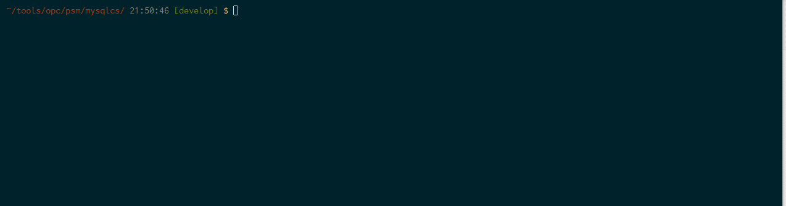

# Oracle MySQL Cloud Service Create Shell

This is a instance creation shell for Oracle MySQL Cloud Service

## Description

[Oracle MySQL Cloud Service](https://cloud.oracle.com/en_US/mysql) provides you the ability to deploy MySQL Server in the Cloud, with each deployment containing a single MySQL Server. You have full access to the features and operations available with MySQL Server.
When you create your instance in the Cloud all you have to do is put necessary information by GUI or REST API. This shell enbables you to put only the minimum information needed.

## Demo

## Features

- Create MySQL instance
- Create JSON file for the instance

## Requirement

- [PaaS Service Manager Command Line](https://docs.oracle.com/en/cloud/paas/java-cloud/pscli/index.html)

## Usage

- `Usage: psm-mysqlcs-create-entry.sh SERVICE-NAME MYSQL-PWD <DESCRIPTION>`
  - **SERVICE-NAME**: Cloud Instance Name, not database name
    - ※ Dataabse Name is hard-coded "`mydatabase`" as default name
  - **MYSQL-PWD**: MySQL User (root) Password
    - ※ Databse User name is hard-coded "`root`" as default user

## Installation

- just git clone it

## Licence

Released under the [MIT license](https://gist.githubusercontent.com/shinyay/56e54ee4c0e22db8211e05e70a63247e/raw/44f0f4de510b4f2b918fad3c91e0845104092bff/LICENSE)

## Author

[shinyay](https://github.com/shinyay)
