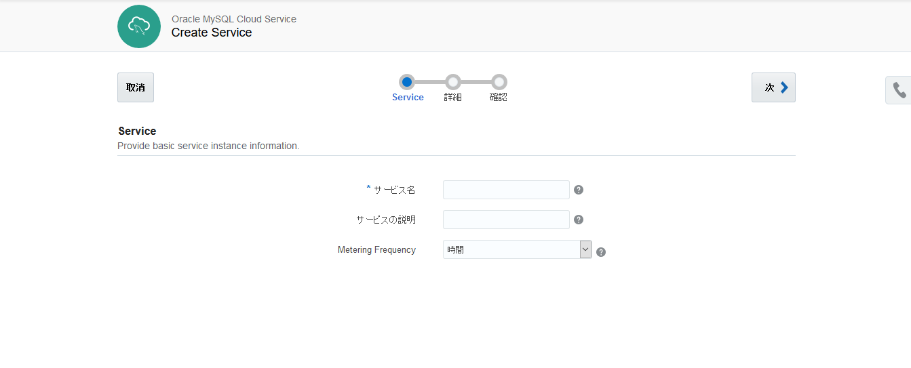
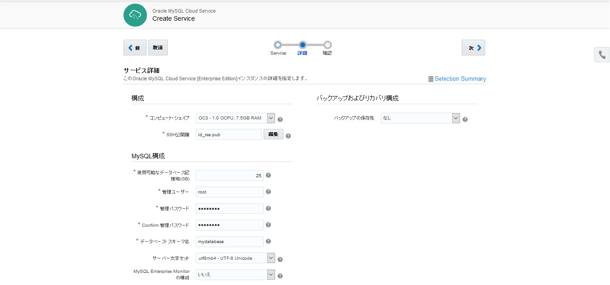
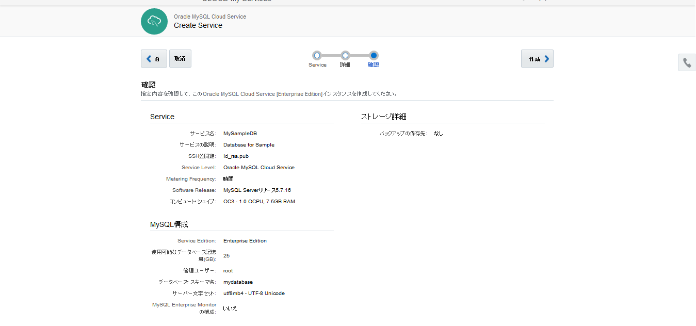
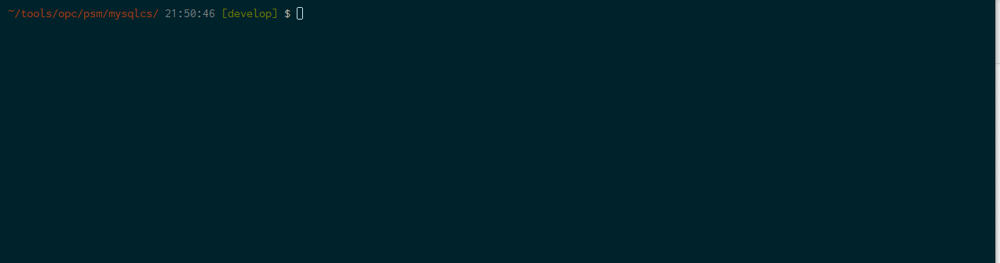

# Oracle MySQL Cloud Service Create Shell

[Oracle MySQL Cloud Service](https://cloud.oracle.com/en_US/mysql) のインスタンス作成を簡略化するシェルです。

## 説明

[Oracle MySQL Cloud Service](https://cloud.oracle.com/en_US/mysql) は、MySQLサーバーをクラウド上で提供するサービスです。提供する MySQL は Enterprise Edition の 全ての機能を含んでおり、MySQL Enterprise Monitor、Query Analyzer、MySQL Workbench などのおなじみのツール群が使用できます。
この MySQL Cloud Service インスタンスの作成は、Web ベースのコンソール画面、または REST API によって行う事ができます:

### Web GUI によるインスタンス作成

Web GUI によるインスタンス作成は、数クリックによる簡単な操作で実施する事ができます:

1.サービスの登録


2.詳細情報の登録


3.登録情報の確認


#### 入力項目

|項目名|説明|
|---|---|
|構成||
|コンピュート・シェイプ|CPU/RAMの組み合わせ|
|SSH公開鍵|SSHログイン時の認証に使用|
|MySQL構成||
|データベース記憶域|GB単位で指定(デフォルト:25GB)|
|管理ユーザ|データベース・ユーザ(デフォルト:root)|
|管理パスワード|データベース・パスワード|
|データベース・スキーマ名|デフォルト:mydatabase|
|サーバ文字セット|デフォルト:utf8mb4|
|MySQL Enterprise Monitorの構成|デフォルト:いいえ|
|バックアップおよびリカバリ構成||
|バックアップの保存先|自動バックアップ構成の有無<br>バックアップを取らない場合は「なし」を選択|
|クラウド・ストレージ・コンテナ|自動バックアップの保存先のStorage Cloud Service のコンテナ名|
|クラウド・ストレージ・ユーザ名|Storage Cloud Service のユーザ名|
|クラウド・ストレージ・パスワード|Storage Cloud Service のパスワード|


### REST API によるインスタンス作成

MySQL Cloud Service の REST API の一覧は次に公開されています:

- [REST API for MySQL Cloud Service](http://docs.oracle.com/cloud/latest/mysql-cloud/CSMCS/index.html)

その一覧の中にあるインスタンス作成の API は次のものになります:

- [Create an Oracle MySQL Cloud Service Instance](http://docs.oracle.com/cloud/latest/mysql-cloud/CSMCS/op-paas-api-v1.1-instancemgmt-%7BidentityDomainId%7D-services-MySQLCS-instances-post.html)

REST API でインスタンスを作成する場合は、エンドポイントURLを指定して必要な情報を記載した JSON ファイルの送付を行って実施します。

- cURL による REST API 実行例

```
curl -i -X POST \
  -u "TestUser@example.org:TestPass" \
  -H "X-ID-TENANT-NAME: TestCorp" \
  -d @createMysqlInstance.json \
  -H "Accept: application/json" \
  -H "Content-Type: application/vnd.com.oracle.oracloud.provisioning.Service+json" \
  https://rest_server_url/paas/api/v1.1/instancemgmt/TestCorp/services/MySQLCS/instances
```

- インスタンス作成用 JSON ファイルサンプル

```
{
  "componentParameters": {
    "mysql": {
      "dbName": "mydatabase",
      "dbStorage": "25",
      "enterpriseMonitor": "No",
      "mysqlPort": "3306",
      "mysqlUserName": "root",
      "mysqlUserPassword": "MyFriendlyPass1!",
      "shape": "oc3"
    }
  },
  "serviceParameters": {
    "backupDestination": "NONE",
    "meteringFrequency": "HOURLY",
    "noRollback": false,
    "serviceDescription": "MyTestMySQLInstance",
    "serviceName": "AnotherTestInstance",
    "vmPublicKeyText": "ssh-rsaAAA your key here...",
    "vmUser": "opc"
  }
}
```

このように REST API でインスタンス作成を行う場合は、JSON ファイルを事前に構成しておく必要があります。もっと手軽に簡単に MySQL 環境を用意するために、JSON ファイルの構成と REST API に実行をラッピングしたシェルを作ってみました。

## 動作イメージ



## 機能

- JSON ファイルの作成
- 作成した JSON ファイルから MySQL インスタンスの作成

## 前提

- [PaaS Service Manager Command Line](https://docs.oracle.com/en/cloud/paas/java-cloud/pscli/index.html) が導入されている事

## 使用方法

- `psm-mysqlcs-create-entry.sh SERVICE-NAME MYSQL-PWD <DESCRIPTION>`
  - **SERVICE-NAME**: MySQL Cloud Service のインスタンス名 (スキーマ名ではない)
    - ※ スキーマはデフォルト値の `mydatabase` にシェルの中でハードコーディングしています
  - **MYSQL-PWD**: MySQL のパスワード
    - ※ ユーザはデフォルト値の `root` にシェルの中でハードコーディングしています

## 導入手順

次のような構成でシェルとテンプレートの JSON ファイルを配置します:

psm-mysqlcs-create-entry.sh

```
.
├── psm-mysqlcs-create-entry.sh
└── template
    └── mysqlcs-entry-template.json
```

## Licence

Released under the [MIT license](https://gist.githubusercontent.com/shinyay/56e54ee4c0e22db8211e05e70a63247e/raw/44f0f4de510b4f2b918fad3c91e0845104092bff/LICENSE)

## Author

[shinyay](https://github.com/shinyay)
