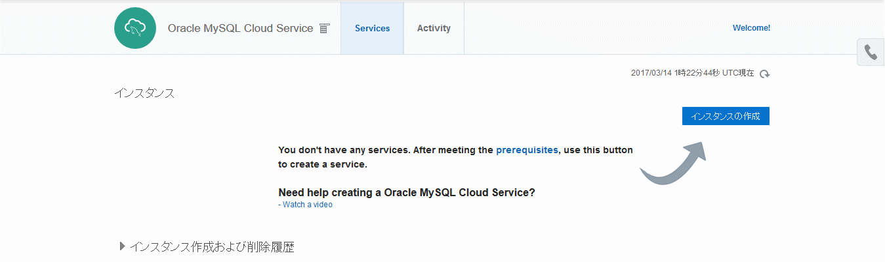

# MySQL with Enterprise Monitor Create Shell

[Oracle MySQL Cloud Service](https://cloud.oracle.com/en_US/mysql) のインスタンス作成を簡略化するシェルです。Database と合わせて、Enterprise Monitor も作成します。

## 説明

[Oracle MySQL Cloud Service](https://cloud.oracle.com/en_US/mysql) は、MySQL Enterprise Edition の 全ての機能を含んでおり、MySQL Enterprise Monitor、Query Analyzer、MySQL Workbench などのおなじみのツール群が使用できるクラウド・サービスです。
ツールも MySQL 本体同様にブラウザベースのGUI、また REST API により簡単に作成する事が可能です。

### REST API によるインスタンス作成

MySQL Cloud Service の REST API の一覧は次に公開されています:

- [REST API for MySQL Cloud Service](http://docs.oracle.com/cloud/latest/mysql-cloud/CSMCS/index.html)

その一覧の中にあるインスタンス作成の API は次のものになります:

- [Create an Oracle MySQL Cloud Service Instance](http://docs.oracle.com/cloud/latest/mysql-cloud/CSMCS/op-paas-api-v1.1-instancemgmt-%7BidentityDomainId%7D-services-MySQLCS-instances-post.html)

Enterprise Monitor を構成するためには、MySQL の情報に加えて以下の情報を定義する必要があります。

|項目名|説明|
|---|---|
|enterpriseMonitor|MySQL Enterprise Monitor 構成の有無 [Yes or No]<br>デフォルト: No|
|enterpriseMonitorAgentUser|エージェント・ユーザ名<br>現状、定義してもエージェントモジュールは導入されない<br>(as of 2017.3.13)|
|enterpriseMonitorAgentPassword|エージェント・パスワード|
|enterpriseMonitorManagerUser|マネージャ・ユーザ名|
|enterpriseMonitorManagerPassword|マネージャ・パスワード|
|mysqlEMPort|MySQL Enterprise Monitor のリスニング・ポート<br>デフォルト: 18443<br>**ora_p2admin_em** を有効化する必要あり|

これらの情報は、テンプレートとして用意している JSON ファイルにデフォルト値を指定して記載済です。

## 動作イメージ



## 機能

- JSON ファイルの作成
- 作成した JSON ファイルから MySQL インスタンスの作成

## 前提

- [PaaS Service Manager Command Line](https://docs.oracle.com/en/cloud/paas/java-cloud/pscli/index.html) が導入されている事

## 使用方法

- `psm-mysqlcs-create-entry.sh [-t TEMPLATE] SERVICE-NAME MYSQL-PWD [DESCRIPTION]`
  - **TEMPLATE**: MySQL Cloud Service 用のテンプレートファイルを指定します
    - 1: (DEFAULT) Just Database
    - 2: Database with Enterprise Monitor
  - **SERVICE-NAME**: MySQL Cloud Service のインスタンス名 (スキーマ名ではない)
    - ※ スキーマはデフォルト値の `mydatabase` にシェルの中でハードコーディングしています
  - **MYSQL-PWD**: MySQL のパスワード
    - ※ ユーザはデフォルト値の `root` にシェルの中でハードコーディングしています

MySQL CS インスタンスが正常作成終了後に、MySQL Enterprise Monitor のリスニング・ポートのアクセス・ルールを有効化します。デフォルトでは、無効化されているためにアクセスが行えなくなっています。

- ` psm mysqlca enable-access-rule -s <MYSQLCS_SERVICE-NAME> -r ora_p2admin_em`

## 導入手順

次のような構成でシェルとテンプレートの JSON ファイルを配置します:

psm-mysqlcs-create-entry.sh

```
.
├── psm-mysqlcs-create-entry.sh
└── template
    ├── mysqlcs-entry-template.json
    └── mysqlcs-entry-with-monitor-template.json
```

## Licence

Released under the [MIT license](https://gist.githubusercontent.com/shinyay/56e54ee4c0e22db8211e05e70a63247e/raw/44f0f4de510b4f2b918fad3c91e0845104092bff/LICENSE)

## Author

[shinyay](https://github.com/shinyay)
